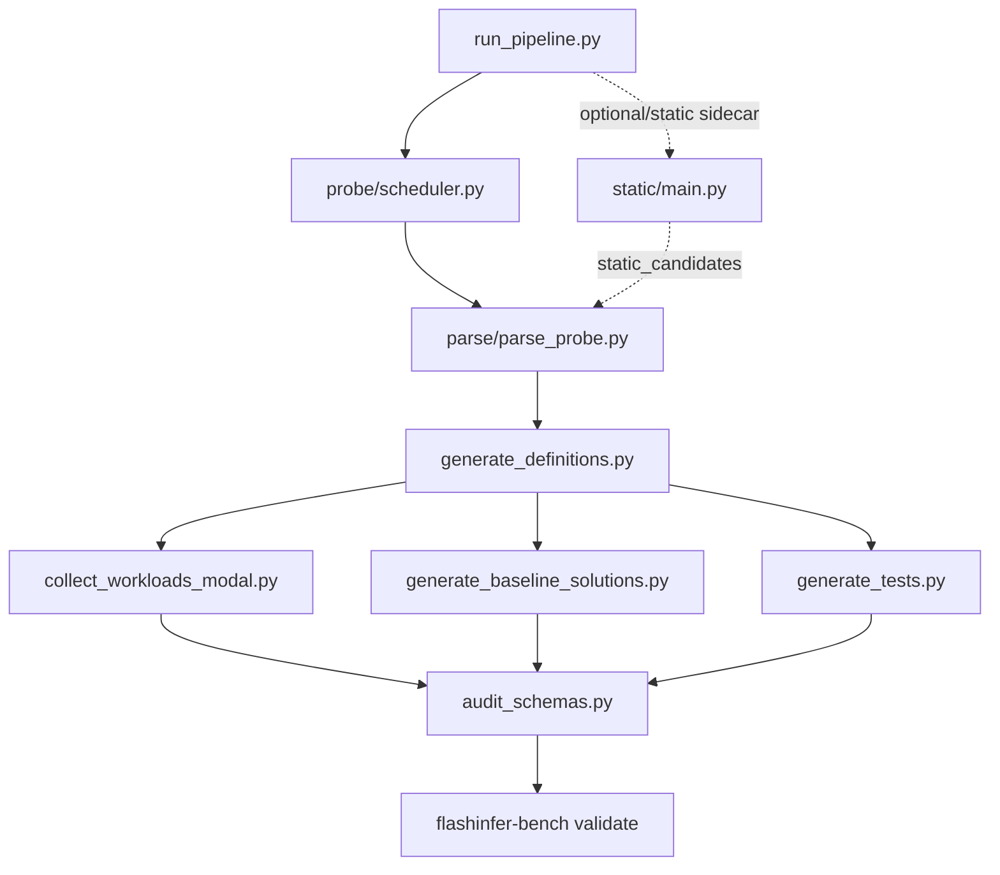

# Pipeline Usage Guide

**English** | [中文](README_ZH.md)

> Operational reference. For internal mechanism details see [INTERNALS.md](INTERNALS.md) / [中文](INTERNALS_ZH.md).

---

## Quick Start

```bash
# New model onboarding (probe → parse → define → collect → solutions → tests → validate)
python3 scripts/run_pipeline.py \
  --fast \
  --model-name ModelOrg/ModelName
```

---

## Project Overview

This pipeline automatically produces FlashInfer-Bench dataset files from serving traces. The main pipeline generates definitions from observed `flashinfer.*` API calls, collects workloads, generates baseline solutions/reference tests, and runs official dataset-level validation.

Pipeline runs write files into isolated `tmp/run/...` directories for review. After review, use `tools/promote_run_to_dataset.py` to merge approved files into a clean dataset root:

```bash
python3 tools/promote_run_to_dataset.py \
    --run-dir tmp/run/ModelOrg_ModelName_YYYYMMDD_HHMMSS \
    --dataset-dir /path/to/flashinfer-trace \
    --source-model ModelOrg/ModelName \
    --dry-run
```

`--baseline-dir` is optional for promote. It is a read-only comparison root used only to report duplicates/new files/conflicts relative to a baseline; it does not affect writes.

| Directory | Contents |
|-----------|----------|
| `definitions/` | Kernel definition JSON (operator signature, inputs/outputs, axes constraints, reference implementation) |
| `workloads/` | Workload JSONL (concrete workload data points for each definition) |
| `solutions/` | Baseline solution JSON (known good implementations: FlashInfer official API wrappers, pure PyTorch, etc.) |
| `traces/` | Eval trace JSONL (baseline execution results per workload: correctness + performance) |
| `tests/references/` | Reference tests (verify that the reference implementation in each definition is bug-free) |

The **flashinfer-bench** package contains the evaluation framework and data models used by this pipeline's validation step.

---

## Prerequisites

### Environment
- **Python 3.11+**
- Local CLI dependencies: `python3 -m pip install -r requirements.txt`
- **Modal** account (for cloud GPU execution; the pipeline fills `MODAL_GPU` / `MODAL_GPU_COUNT` defaults from model metadata and the model name)
- CUDA/SGLang/FlashInfer runtime packages are installed inside the Modal images used by probe, collect, and reference-test jobs.

---

## Command Cheat Sheet

Use these as the canonical command forms.

| Goal | Command |
|------|---------|
| Run the daily isolated pipeline for one model | `python3 scripts/run_pipeline.py --model-name ModelOrg/ModelName` |
| Run broader scenario coverage for one model | `python3 scripts/run_pipeline.py --full --model-name ModelOrg/ModelName` |
| Run only the paged-prefill path | `python3 scripts/run_pipeline.py --paged --model-name ModelOrg/ModelName` |
| Validate a dataset with the standard checks | `python3 scripts/run_pipeline.py --smoke --official-validate-dataset /path/to/dataset` |
| Validate a dataset without GPU checks | `python3 scripts/run_pipeline.py --smoke --official-validate-dataset /path/to/dataset --official-validate-disable-gpu` |
| Parse an existing probe summary | `python3 scripts/run_pipeline.py --parse --probe-output tmp/run/.../probe/aggregated_summary.json` |
| Generate definitions from an existing inventory | `python3 scripts/run_pipeline.py --definitions --inventory tmp/run/.../kernel_inventory.json` |
| Collect workloads from reviewed definitions | `python3 scripts/run_pipeline.py --collect --definitions-dir tmp/run/.../definitions --model-name ModelOrg/ModelName` |
| Generate baseline solutions from definitions | `python3 scripts/run_pipeline.py --solutions --definitions-dir tmp/run/.../definitions` |
| Generate reference tests from definitions | `python3 scripts/run_pipeline.py --tests --definitions-dir tmp/run/.../definitions` |
| Run generated reference tests on Modal GPU | `REFERENCE_TESTS_DIR=tmp/run/.../tests/references DEFINITIONS_DIR=tmp/run/.../definitions modal run tools/run_reference_tests_modal.py --all` |

Single-step commands such as `--parse`, `--definitions`, `--collect`, `--solutions`,
`--tests`, and `--validate` intentionally run only that step. Use `--fast` or
`--full` for multi-step model onboarding.

```bash
python3 scripts/run_pipeline.py --help      # common options
python3 scripts/run_pipeline.py --help-all  # all advanced/debug options
```

---

## Pipeline Steps

| Step | Description | Script |
|------|-------------|--------|
| 1a | Runtime Probe — default primary evidence; probe real serving API calls on Modal GPU and stage official fi_trace output when available | `probe/scheduler.py` |
| 1b | Static Candidates — optional sidecar; build static-only candidates from HF config / SGLang source without inference | `static/main.py` |
| 2 | Runtime Parse — parse probe results → kernel_inventory for the runtime path | `parse/parse_probe.py` |
| 2b | LLM Classify — optional trace_id classification inside Runtime Parse when regex rules miss | `parse/llm_classify.py` |
| 3 | Definitions — generate definition JSON | `generate_definitions.py` |
| 4a | Collect — collect workloads with the Python hook-based collector | `collect_workloads_modal.py` |
| 4b | Baseline Solutions — generate solution JSON from definitions | `generate_baseline_solutions.py` |
| 5 | Tests — generate reference tests; fails explicitly if no adapter baseline solution exists | `generate_tests.py` |
| 6a | Schema Audit — check definition/workload/solution JSON schemas | `audit_schemas.py` |
| 6b | Validation — run `flashinfer-bench validate` to check layout/definition/workload | `flashinfer-bench` |

---

## Key Outputs

| File | Path |
|----------|------|
| Definition/file index | `definition_index.json` |
| Kernel definitions | `definitions/{op_type}/{def_name}.json` |
| Workload data | `workloads/{op_type}/{def_name}.jsonl` |
| Baseline solutions | `solutions/baseline/{op_type}/{def_name}/` |
| Reference tests | `tests/references/test_{def_name}.py` |
| Validation report | `<dataset>/reports/report-*.txt/json` |

These paths follow the official-style dataset layout used by the pipeline and
runtime. During onboarding, they are generated inside the isolated run
directory first; promotion copies approved files into the selected dataset root.
`definition_index.json` is a review-only summary generated from actual files; it is not used for collect or definition-generation decisions.

---

## Optional Flags

**General:**

| Flag | Description |
|------|-------------|
| `--fast`, `--full` | Full pipeline profiles; `--fast` is the default. Both cover default/ragged plus paged-prefill paths by default. `--full` runs broader probe scenarios. Explicit flags still override profile defaults |
| `--smoke` | Validation-only profile: runs dataset validation without probe/collect |
| `--static`, `--probe`, `--parse`, `--definitions`, `--collect`, `--solutions`, `--tests`, `--validate` | Run exactly one pipeline step |
| `--tp 4` | Manually set TP. Default inference order: sgl-cookbook → early HF `config.json` metadata (for example DeepSeek-V4 / large MoE) → model-name size fallback |
| `MODAL_GPU=A100-80GB` | Optional environment variable to override the Modal GPU; if unset, large models detected from HF config or model name default to `A100-80GB`, and small models default to `L40S` |
| `MODAL_GPU_COUNT=2` | Optional environment variable to override the Modal GPU count; if unset, it defaults to TP |
| `PROBE_SGLANG_IMAGE=lmsysorg/sglang:v0.5.12.post1` | Optional environment variable to override the default pinned SGLang image used by probe/collect. Set it to an empty string to use the PyTorch + PyPI SGLang fallback path. |
| `PROBE_EXTRA_PIP_PACKAGES='kernels==0.14.1'` | Optional environment variable for runtime compatibility fixes; extra packages are installed into the Modal image after SGLang/FlashInfer setup |
| `PROBE_FORWARD_ENV_PREFIXES=SGLANG_,CUDA_,NCCL_` | Optional comma/space separated prefixes for environment variables forwarded into Modal runtime images. Defaults to `SGLANG_` with internal probe variables excluded |
| `PROBE_FORWARD_ENV_NAMES=MY_RUNTIME_FLAG` | Optional comma/space separated explicit environment variable names forwarded into Modal runtime images |
| `--hf-config path/config.json` | Manually specify model config. If omitted, the pipeline downloads `config.json` once near startup and reuses it for TP planning, static candidates, and parse |
| `--output-root tmp/foo` | Set the run output root; default is `tmp/run` |
| `--dry-run` | Print commands that would be executed without running them |

**Runtime probe:**

| Flag | Description |
|------|-------------|
| `--with-static` | After runtime probe/parse, also attach static-only candidates to the inventory |
| `--static` | Run static candidates only, without serving inference |
| `--probe-coverage fast` | Default probe profile: 3 short scenarios × 3 sampling configs, 9 generate calls total |
| `--probe-coverage full` | Broad probe profile: 7 scenarios × 3 sampling configs |
| `--paged` | Run probe only through the paged-prefill path |
| `--both` | Run probe through both default/ragged and paged-prefill paths; this is the `--fast`/`--full` default |
| `--probe-page-sizes 1 64` | Override paged-prefill page sizes. `--fast`/`--full` default to `64`; pass multiple values only when you intentionally want multiple paged passes |
| `--force-flashinfer-backends` | In probe and collect, also set supported fine-grained SGLang backend knobs (`prefill_attention_backend`, `decode_attention_backend`, `sampling_backend`) to `flashinfer` |
| `--probe-resume-function-call-id fc-...` | Reattach to an already submitted Modal probe job instead of launching a new one |
| `--no-probe-detach` | Disable the default `modal run --detach` behavior; normally leave this unset so a local client disconnect does not stop the remote app |

**LLM diagnostic classification (Step 2b):**

| Flag | Description |
|------|-------------|
| `--llm-classify` | Use LLM to suggest classifications for trace_ids not covered by reviewed adapters/rules (requires `ANTHROPIC_API_KEY`; results cached in `scripts/parse/llm_classify_cache.json`; suggestions are diagnostic only). When suggestions exist, the pipeline also writes review proposals under `tmp/run/<run>/llm_diagnostics/parse_rules/`. |
| `--llm-base-url <url>` | LLM API proxy URL (otherwise reads `ANTHROPIC_BASE_URL`) |

**Collect options:**

| Flag | Description |
|------|-------------|
| `--collect-batch-sizes 1 2 4 8 16 32 64` | Outer batch sizes for streaming collect (these are the defaults) |
| `--collect-workloads-per-batch 4` | Max workloads appended per definition per batch-size pass (default: 4) |
| `--collect-max-dups-per-axes 2` | Max candidates with identical axes to retain in a single sanitize round |
| `--no-collect-streaming` | Disable per-batch-size streaming; use the single-round sanitize |
| `--collect-debug-hooks` | Enable hook debug logging; runs only a few inference rounds for debugging missing captures |
| `--skip-collect` | Skip the collect step (when workloads already exist) |

**Dataset validation:**

| Flag | Description |
|------|-------------|
| Default behavior | Automatically run strict schema audit, then `flashinfer-bench validate --checks layout,definition,workload` at the end of the pipeline |
| `--smoke` | Run strict schema audit plus `layout,definition,workload` validation against the dataset root. GPU validation is used unless `--official-validate-disable-gpu` is set. |
| `--validate-generated-artifacts` | Optional check for existing datasets (e.g. `--smoke --official-validate-dataset .`): rebuild solutions and tests from definitions under `tmp/run/.../generated_artifact_check/` and verify the generator code still works. Usually unnecessary for a fresh full pipeline run. |
| `--skip-official-validate` | Skip only upstream `flashinfer-bench validate`; schema audit still runs in `--validate` / `--smoke` |
| `--official-validate-strict` | Exit with non-zero status on validation warnings/errors |
| `--official-validate-disable-gpu` | Pass `--disable-gpu` to upstream validation for CPU-only structural checks |
| `--official-validate-checks <checks>` | Specify validation checks (default: `layout,definition,workload`); solution/trace/baseline/benchmark are intentionally skipped by default |

---

## Resuming from a Checkpoint

Skip earlier steps to resume from the middle of the pipeline:

| Flag | Effect |
|------|--------|
| `--probe-output tmp/run/.../probe/aggregated_summary.json` | Skip probe; use this existing probe output file |
| `--probe-output-dir tmp/run/.../probe --probe-resume-function-call-id fc-...` | Resume polling an in-flight Modal probe. The call id and any error status are saved in `probe/probe_run.json` |
| `--inventory tmp/run/.../kernel_inventory.json` | Skip probe + parse; start from the inventory |
| `--skip-collect` | Skip collect |
| `--static`, `--probe`, `--parse`, `--definitions`, `--collect`, `--solutions`, `--tests`, `--validate` | Run only a single step |

```bash
# Example: run only collect from a definitions directory
python scripts/run_pipeline.py --collect \
    --definitions-dir tmp/run/.../definitions \
    --model-name Qwen/Qwen3.5-35B-A3B
```

Collect intentionally refuses the repo-root `definitions/` directory by default,
because that would collect historical definitions from the whole repository. Use
an isolated run directory, or pass `--allow-global-definitions` only when that is
intentional.

---

## Appendix

### Script Reference

#### Pipeline Entrypoints

| Script | Description | Input | Output |
|--------|-------------|-------|--------|
| `run_pipeline.py` | Orchestrates all steps | — | all intermediate files |
| `probe/scheduler.py` | Modal cloud SGLang inference tracing (probe entry point) | model + config | aggregated_summary.json |
| `parse/parse_probe.py` | Parse probe results; keeps kernels only when there is real `fi_api:flashinfer.*` evidence | aggregated_summary.json | kernel_inventory.json |
| `generate_definitions.py` | Generate definition JSON | kernel_inventory.json | definitions/*.json |
| `collect_workloads_modal.py` | Collect workloads on Modal (only `fi_api:flashinfer.*`) | definitions + model | workloads/*.jsonl |
| `generate_baseline_solutions.py` | Generate baseline solution JSON; each op_type adapter provides its own generation logic | definitions | solutions/baseline/ |
| `generate_tests.py` | Generate reference tests; fails explicitly if no adapter baseline solution exists | definitions | tests/references/test_*.py |
| `audit_schemas.py` | Strict JSON schema audit for definitions, workloads, and solutions | dataset root | — |

#### Review Tools

| Script | Description |
|--------|-------------|
| `tools/promote_run_to_dataset.py` | Merge a reviewed run into a clean dataset root; only promotes `fi_api:flashinfer.*` by default; deduplicates by definition/workload/blob; supports `--baseline-dir` for a read-only comparison report |
| `tools/run_reference_tests_modal.py` | Run reference tests on Modal, useful when local GPU access is unavailable or remote reproduction is needed |
| `tools/propose_parse_rules.py` | Convert `llm_classified_trace_ids` / unmatched trace IDs into review-only proposal files; normally invoked automatically after `--llm-classify` |
| `tools/apply_llm_kernel_proposal.py` | After human review, write one promoted proposal as `scripts/adapters/_draft_<op_type>.py`; defaults to dry-run |
| `tools/validate_adapter_draft.py` | Smoke-validate one adapter draft without registering it; writes reports/files under `.dev_checks/adapter_drafts/` |
| `tools/clean_local_outputs.py` | Dry-run local cleanup for empty, failed, or throwaway run directories; pass `--apply` to delete |

Typical usage:

```bash
# Review what a completed pipeline run would add to a dataset checkout.
python3 tools/promote_run_to_dataset.py \
  --run-dir tmp/run/<run> \
  --dataset-dir /path/to/flashinfer-trace-dataset \
  --source-model ModelOrg/ModelName \
  --dry-run

# After reviewing the dry-run report, remove --dry-run to write files.
python3 tools/promote_run_to_dataset.py \
  --run-dir tmp/run/<run> \
  --dataset-dir /path/to/flashinfer-trace-dataset \
  --source-model ModelOrg/ModelName

# Run all generated reference tests on Modal.
REFERENCE_TESTS_DIR=tmp/run/<run>/tests/references \
DEFINITIONS_DIR=tmp/run/<run>/definitions \
  modal run tools/run_reference_tests_modal.py --all

# Run selected generated reference tests on Modal.
REFERENCE_TESTS_DIR=tmp/run/<run>/tests/references \
DEFINITIONS_DIR=tmp/run/<run>/definitions \
  modal run tools/run_reference_tests_modal.py \
    --tests test_rmsnorm_h1024.py,test_gqa_ragged_prefill_causal_h16_kv8_d128.py

# Manually create review-only proposals for an existing run/inventory.
# Pipeline runs with --llm-classify do this automatically for LLM-classified IDs.
python3 tools/propose_parse_rules.py \
  --run-dir tmp/run/<run> \
  --include-unmatched \
  --dry-run

# After human review, write one promoted proposal as an adapter draft.
python3 tools/apply_llm_kernel_proposal.py \
  tmp/run/<run>/llm_diagnostics/parse_rules \
  --trace-id "flashinfer.example.trace" \
  --promote \
  --apply \
  --validate

# Inspect local cleanup candidates without deleting anything.
python3 tools/clean_local_outputs.py

# Delete cleanup candidates after reviewing the dry-run output.
python3 tools/clean_local_outputs.py --apply
```

#### `parse/llm_classify.py` — LLM Diagnostic Classifier

`trace_id`s not covered by reviewed regex rules can be sent to an LLM for classification suggestions; results are cached in `scripts/parse/llm_classify_cache.json`.
LLM suggestions are written to `llm_classified_trace_ids` in the inventory for review only. They do not modify source rules and do not generate formal kernel entries automatically.
Official `fi_api` values are not generated by LLM or static mappings — they are extracted by the parser from actually observed `flashinfer.*` trace IDs.

When `run_pipeline.py` is executed with `--llm-classify`, it automatically runs
`tools/propose_parse_rules.py` after parse if the inventory contains
`llm_classified_trace_ids`. The generated review files are written to
`tmp/run/<run>/llm_diagnostics/parse_rules/`. Use `tools/propose_parse_rules.py`
manually only when reprocessing an existing inventory or when adding
`--include-unmatched`.

To turn a good LLM suggestion into adapter work, use the review/apply tools:

```bash
python3 tools/propose_parse_rules.py \
  --run-dir tmp/run/<run>

python3 tools/apply_llm_kernel_proposal.py \
  tmp/run/<run>/llm_diagnostics/parse_rules \
  --trace-id "flashinfer.example.trace" \
  --promote \
  --apply
```

This writes an adapter draft only. The draft is not auto-registered because its
filename starts with `_draft_`; review and complete it before renaming it to a
live adapter module.

`--validate` attempts draft smoke checks after writing the file. It compiles and
imports the draft, checks the reviewed trace_id classification, builds candidate
kernels from the proposal signatures, and schema-validates generated
definitions under `.dev_checks/adapter_drafts/`. An initial draft usually fails at
`build_kernels()` or `generate_definition()` because those parts require human
implementation; that failure is a diagnostic, not an automatic rejection.
Passing this check only means the draft is structurally runnable; it does not
prove semantic correctness or register the adapter.

Drafts also include commented baseline-solution and reference-test skeletons
when the LLM proposal contains relevant notes. These are review aids only; they
must be implemented and uncommented by hand before the adapter is renamed.

See [INTERNALS.md](INTERNALS.md) for details.

---

### Script Dependency Graph

High-level flow:



Detailed script flow:

```
── Phase 1: run_pipeline.py ──────────────────────────────────────────

  static/main.py  (optional --static; runtime sidecar by default)
    └─→ output: static_kernel_inventory.json
    └─→ merges: kernel_inventory.json.static_candidates

  probe/scheduler.py  (Step 1, Modal GPU)
    └─→ uses: probe/runtime.py, probe/inference_runner.py, probe/sitecustomize*.py
    └─→ output: tmp/run/<run>/probe/aggregated_summary.json

  parse/parse_probe.py  (Step 2)
    └─→ reads:  aggregated_summary.json
    └─→ output: tmp/run/<run>/kernel_inventory.json
    (with --llm-classify, writes review proposals under llm_diagnostics/parse_rules/)

  generate_definitions.py  (Step 3)
    └─→ reads:  kernel_inventory.json
    └─→ output: definitions/*.json

  collect_workloads_modal.py  (Step 4, Modal GPU)
    └─→ uses: collect_workloads/_fi_hook.py
    └─→ requires: definitions/ to already exist
    └─→ output: workloads/*.jsonl, blob/
    (new op_types must add a reviewed scripts/adapters/<op_type>.py first)

  generate_baseline_solutions.py  (Step 4b)
    └─→ reads:  definitions/
    └─→ output: solutions/baseline/

  generate_tests.py  (Step 5)
    └─→ reads:  definitions/
    └─→ output: tests/references/test_*.py
    └─→ note:   this generates tests; correctness execution is separate

  audit_schemas.py  (Step 6a)
    └─→ reads:  definitions/, workloads/, solutions/
    └─→ checks: JSON schema

  flashinfer-bench validate  (Step 6b)
    └─→ reads:  dataset root
    └─→ default: GPU validation
    └─→ optional: --official-validate-disable-gpu for CPU-only structural checks

```

---

### Directory Structure

```
scripts/
├── run_pipeline.py                 ← main entry point (one-command pipeline)
├── pipeline/                       ← pipeline CLI, config, path, and step orchestration
├── generate_definitions.py         ← generate definition JSON
├── collect_workloads_modal.py      ← Modal workload collection entry point
├── collect_workloads/              ← workload batching, hook specs, and builder helpers
│   ├── _fi_hook.py                 ← FlashInfer patch script injected into collection workers
│   └── sitecustomize.py            ← collection import hook entry point
├── generate_baseline_solutions.py  ← generate baseline solution JSON
├── generate_tests.py               ← generate reference tests
├── adapters/                      ← per-op_type classify/build/generate adapters
│   ├── _param_utils.py            ← shared config/dimension helper functions
│   ├── _solution_utils.py         ← shared baseline solution payload helpers
│   ├── extractors.py              ← shared runtime signature extractors
│   └── *.py                       ← per-op adapter modules
├── static/                        ← static candidates from HF config + SGLang source
│   ├── main.py                    ← static CLI entry point
│   ├── sglang_analyzer.py         ← lightweight SGLang source scanner
│   └── static_kernel_candidates.py ← calls adapter.static_candidates()
├── parse/                         ← parse modules (parse_probe.py, llm_classify.py, rules, etc.)
│   ├── parse_probe.py             ← parse probe results (entry point)
│   ├── llm_classify.py            ← LLM diagnostic classifier (with local cache)
│   ├── config_enrichment.py       ← calls adapter.resolve_config_params() for NEEDS_CONFIG entries
│   ├── diagnostics.py             ← runtime evidence, noise, LLM audit, deferred helpers
│   ├── inventory_helpers.py       ← matched-kernel buckets, observation fields, dedup
│   └── rules.py                   ← rules entry point and adapter registry bridge
├── test_generators/               ← reference test generator helpers (one module per op_type)
├── audit_schemas.py            ← strict JSON schema audit CLI
├── artifact_schemas.py            ← definition/workload/solution schema models
├── fixtures/
│   └── sharegpt_100.json          ← prompt fixture used by probe/collect flows
├── probe/                         ← Modal probe three-script set
│   ├── scheduler.py               ← probe entry point (modal run)
│   ├── fi_trace_integration.py    ← official fi_trace patch/preflight/transport
│   ├── fi_trace_runtime_patch.py  ← runtime compatibility patch for fi_trace integration
│   ├── runtime.py                 ← runtime injected into container (uploaded via add_local_dir)
│   ├── inference_runner.py        ← subprocess inference executor
│   ├── sitecustomize.py           ← probe import hook entry point
│   └── sitecustomize_bundle.py    ← bundled sitecustomize payload
```
