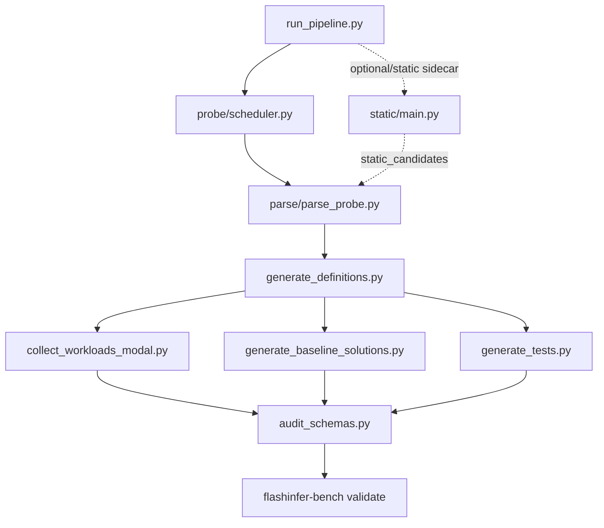

# Pipeline 使用指南

[English](README.md) | **中文**

> 操作手册。内部机制说明见 [INTERNALS_ZH.md](INTERNALS_ZH.md) / [English](INTERNALS.md)。

---

## 快速开始

```bash
# 新模型 onboarding（probe → parse → define → collect → solutions → tests → validate）
python3 scripts/run_pipeline.py \
  --fast \
  --model-name ModelOrg/ModelName
```

---

## 项目概述

本 pipeline 从 serving traces 自动生成 FlashInfer-Bench dataset 文件。主线流程从观测到的 `flashinfer.*` API 生成 definition、收集 workload、生成 baseline solutions/reference tests，并调用官方 validator 做 dataset 级检查。

Pipeline run 会先把文件写到隔离的 `tmp/run/...` 目录，供 review 使用。Review 通过后，再用 `tools/promote_run_to_dataset.py` 把批准的文件合并到干净的正式 dataset root：

```bash
python3 tools/promote_run_to_dataset.py \
    --run-dir tmp/run/ModelOrg_ModelName_YYYYMMDD_HHMMSS \
    --dataset-dir /path/to/flashinfer-trace \
    --source-model ModelOrg/ModelName \
    --dry-run
```

`--baseline-dir` 是 promote 的可选只读对照目录，只用于报告和官方 baseline 相比哪些产物重复/新增/冲突；不参与实际写入。

| 目录 | 内容 |
|------|------|
| `definitions/` | kernel 定义 JSON（算子签名、输入输出、axes 约束、reference 实现） |
| `workloads/` | workload JSONL（每个 definition 的具体工作负载数据点） |
| `solutions/` | baseline solution JSON（已知的好实现，如 FlashInfer 官方 API wrapper 或纯 PyTorch） |
| `traces/` | eval trace JSONL（baseline 在每个 workload 上的执行结果：正确性 + 性能） |
| `tests/references/` | reference test（验证 definition 里的 reference 实现本身没有 bug） |

**flashinfer-bench** 包含评估框架和数据模型，供本 pipeline 的 validation 步骤使用。

---

## 前置条件

### 环境
- **Python 3.11+**, **PyTorch**, **safetensors**, **huggingface_hub**
- **Modal** 账号（用于云端 GPU 执行；pipeline 会按模型 metadata 和模型名给 `MODAL_GPU` / `MODAL_GPU_COUNT` 补默认值）
- **`flashinfer-bench`** Python 包，用于 dataset validation：`pip install flashinfer-bench`

---

## 命令速查表

以下是当前推荐的标准命令形态。

| 目标 | 命令 |
|------|------|
| 对单个模型跑日常隔离 pipeline | `python3 scripts/run_pipeline.py --model-name ModelOrg/ModelName` |
| 对单个模型跑更广的 scenario 覆盖 | `python3 scripts/run_pipeline.py --full --model-name ModelOrg/ModelName` |
| 只跑 paged-prefill 路径 | `python3 scripts/run_pipeline.py --paged --model-name ModelOrg/ModelName` |
| 使用标准检查验证 dataset | `python3 scripts/run_pipeline.py --smoke --official-validate-dataset /path/to/dataset` |
| 不启用 GPU 检查验证 dataset | `python3 scripts/run_pipeline.py --smoke --official-validate-dataset /path/to/dataset --official-validate-disable-gpu` |
| 解析已有 probe summary | `python3 scripts/run_pipeline.py --parse --probe-output tmp/run/.../probe/aggregated_summary.json` |
| 从已有 inventory 生成 definitions | `python3 scripts/run_pipeline.py --definitions --inventory tmp/run/.../kernel_inventory.json` |
| 从已 review 的 definitions 收 workload | `python3 scripts/run_pipeline.py --collect --definitions-dir tmp/run/.../definitions --model-name ModelOrg/ModelName` |
| 从 definitions 生成 baseline solutions | `python3 scripts/run_pipeline.py --solutions --definitions-dir tmp/run/.../definitions` |
| 从 definitions 生成 reference tests | `python3 scripts/run_pipeline.py --tests --definitions-dir tmp/run/.../definitions` |
| 在 Modal GPU 上运行生成的 reference tests | `REFERENCE_TESTS_DIR=tmp/run/.../tests/references DEFINITIONS_DIR=tmp/run/.../definitions modal run tools/run_reference_tests_modal.py --all` |

`--parse`、`--definitions`、`--collect`、`--solutions`、`--tests`、`--validate`
这类单步命令只跑对应一步。完整多步骤 model onboarding 用 `--fast` 或 `--full`。

```bash
python3 scripts/run_pipeline.py --help      # 常用参数
python3 scripts/run_pipeline.py --help-all  # 全部高级/调试参数
```

---

## Pipeline 步骤

| Step | 说明 | 脚本 |
|------|------|------|
| 1a | Runtime Probe — 默认主证据，Modal GPU 探测真实 serving API 调用，并可接入 official fi_trace 输出 | `probe/scheduler.py` |
| 1b | Static Candidates — 可选 sidecar，从 HF config / SGLang source 生成 static-only candidates，不跑 inference | `static/main.py` |
| 2 | Runtime Parse — 解析 probe 结果 → kernel_inventory（runtime 路径） | `parse/parse_probe.py` |
| 2b | LLM Classify — 可选，在 Runtime Parse 中识别 regex 未覆盖的 trace_id | `parse/llm_classify.py` |
| 3 | Definitions — 生成 definition JSON | `generate_definitions.py` |
| 4a | Collect — 使用 Python hook collector 收集 workloads | `collect_workloads_modal.py` |
| 4b | Baseline Solutions — 根据 definitions 生成 solution JSON | `generate_baseline_solutions.py` |
| 5 | Tests — 生成 reference tests；无对应 adapter baseline solution 时报错退出 | `generate_tests.py` |
| 6a | Schema Audit — 检查 definition/workload/solution JSON schema | `audit_schemas.py` |
| 6b | Validation — 调用 `flashinfer-bench validate` 检查 layout/definition/workload | `flashinfer-bench` |

---

## 关键输出

| 产物 | 路径 |
|------|------|
| definition / 文件总览 | `definition_index.json` |
| kernel 定义 | `definitions/{op_type}/{def_name}.json` |
| workload 数据 | `workloads/{op_type}/{def_name}.jsonl` |
| baseline solution | `solutions/baseline/{op_type}/{def_name}/` |
| reference test | `tests/references/test_{def_name}.py` |
| validation report | `<dataset>/reports/report-*.txt/json` |

这些路径是 pipeline/runtime 使用的 official-style dataset layout。Onboarding
时先在隔离 run 目录里生成；promote 阶段再把批准的文件复制到指定
dataset root。
`definition_index.json` 只用于 review，内容从实际文件扫描出来，不参与 collect 或 definition 生成决策。

---

## 可选 Flag

**通用：**

| Flag | 说明 |
|------|------|
| `--fast`, `--full` | 完整 pipeline profile；`--fast` 是默认值。默认同时覆盖 default/ragged 和 paged-prefill 路径。`--full` 会跑更广的 probe 场景。显式写的其它 flag 仍会覆盖 profile 默认值 |
| `--smoke` | 验证专用 profile：只跑 dataset validation，不跑 probe/collect |
| `--static`, `--probe`, `--parse`, `--definitions`, `--collect`, `--solutions`, `--tests`, `--validate` | 只跑一个 pipeline step |
| `--tp 4` | 手动指定 TP。默认推断顺序：sgl-cookbook → 提前下载的 HF `config.json` metadata（例如 DeepSeek-V4 / 大 MoE）→ 模型名大小 fallback |
| `MODAL_GPU=A100-80GB` | 可选环境变量，手动覆盖 Modal GPU；未设置时，会根据 HF config 或模型名识别大模型默认 `A100-80GB`，小模型默认 `L40S` |
| `MODAL_GPU_COUNT=2` | 可选环境变量，手动覆盖 Modal GPU 数；未设置时默认等于 TP |
| `PROBE_SGLANG_IMAGE=lmsysorg/sglang:v0.5.12.post1` | 可选环境变量，用于覆盖 probe / collect 默认使用的 pinned SGLang 镜像。设为空字符串时走 PyTorch + PyPI SGLang fallback 路径。 |
| `PROBE_EXTRA_PIP_PACKAGES='kernels==0.14.1'` | 可选环境变量，用于补 runtime 兼容依赖；这些包会在 SGLang / FlashInfer 依赖之后额外安装到 Modal 镜像里 |
| `PROBE_FORWARD_ENV_PREFIXES=SGLANG_,CUDA_,NCCL_` | 可选环境变量，按前缀把本地环境变量转发进 Modal runtime 镜像。默认转发 `SGLANG_`，但排除 probe 内部变量 |
| `PROBE_FORWARD_ENV_NAMES=MY_RUNTIME_FLAG` | 可选环境变量，显式指定要转发进 Modal runtime 镜像的环境变量名，支持逗号或空格分隔 |
| `--hf-config path/config.json` | 手动指定模型 config。未指定时，pipeline 会在启动早期下载一次 `config.json`，并复用于 TP 规划、static candidates 和 parse |
| `--output-root tmp/foo` | 指定 run 输出根目录；默认 `tmp/run` |
| `--dry-run` | 只打印要执行的命令，不实际运行 |

**Runtime probe：**

| Flag | 说明 |
|------|------|
| `--with-static` | runtime probe/parse 之后，额外把 static-only candidates 附到 inventory |
| `--static` | 只跑静态候选路径，不跑 serving inference |
| `--probe-coverage fast` | 默认 probe 配置：3 个短场景 × 3 组 sampling，共 9 次 generate，用于低成本 kernel 覆盖发现 |
| `--probe-coverage full` | 广覆盖 probe 配置：7 个 scenario × 3 组 sampling |
| `--paged` | probe 只跑 paged-prefill 路径 |
| `--both` | probe 同时跑 default/ragged 和 paged-prefill 路径；这是 `--fast`/`--full` 默认行为 |
| `--probe-page-sizes 1 64` | 覆盖 paged-prefill page size。`--fast`/`--full` 默认使用 `64`；只有明确要多跑 paged pass 时才传多个值 |
| `--force-flashinfer-backends` | probe 和 collect 中，把支持的细粒度 SGLang backend 参数（`prefill_attention_backend`、`decode_attention_backend`、`sampling_backend`）也设为 `flashinfer` |
| `--probe-resume-function-call-id fc-...` | 重新 attach 到已经提交的 Modal probe 任务，不新开云端任务 |
| `--no-probe-detach` | 关闭默认的 `modal run --detach`；一般不要设置，这样本地 client 断线不会停掉远端 app |

**LLM 兜底分类（Step 2b）：**

| Flag | 说明 |
|------|------|
| `--llm-classify` | LLM 给正式规则未覆盖的 trace_id 生成分类建议（需 `ANTHROPIC_API_KEY`，缓存到 `scripts/parse/llm_classify_cache.json`；只作诊断，不自动进入正式 kernels）。如果产生建议，pipeline 会自动在 `tmp/run/<run>/llm_diagnostics/parse_rules/` 下写 review proposal。 |
| `--llm-base-url <url>` | LLM API 代理地址（否则读 `ANTHROPIC_BASE_URL`） |

**Collect 选项：**

| Flag | 说明 |
|------|------|
| `--collect-batch-sizes 1 2 4 8 16 32 64` | streaming collect 的外层 batch size，默认即这组 |
| `--collect-workloads-per-batch 4` | 每个 batch-size pass 每个 definition 默认最多追加 4 条 workload |
| `--collect-max-dups-per-axes 2` | 同一轮 sanitize 中，相同 axes 最多保留 2 个候选 |
| `--no-collect-streaming` | 关闭分 batch-size streaming，使用单轮 sanitize |
| `--collect-debug-hooks` | 打开 hook 调试日志，只跑少量轮次，用于查 missing capture |
| `--skip-collect` | 跳过 collect 步骤（workloads 已有时使用） |

**Dataset validation：**

| Flag | 说明 |
|------|------|
| 默认行为 | pipeline 结束后自动运行 strict schema audit，然后运行 `flashinfer-bench validate --checks layout,definition,workload` |
| `--smoke` | 对 dataset root 严格跑 schema audit 和 `layout,definition,workload` validation。默认使用 GPU validation，除非显式传 `--official-validate-disable-gpu`。 |
| `--validate-generated-artifacts` | 用于复核已有 dataset 的可选检查（如 `--smoke --official-validate-dataset .`）：基于 definitions 在 `tmp/run/.../generated_artifact_check/` 下重建 solutions 和 tests，验证生成器代码仍然正常。完整新 pipeline run 通常不需要开启。 |
| `--skip-official-validate` | 只跳过 upstream `flashinfer-bench validate`；`--validate` / `--smoke` 仍会跑 schema audit |
| `--official-validate-strict` | validation warning/error 时让 pipeline 以非 0 状态退出 |
| `--official-validate-disable-gpu` | 给 upstream validation 传 `--disable-gpu`，用于 CPU-only 结构检查 |
| `--official-validate-checks <checks>` | 指定检查项（默认 `layout,definition,workload`）；solution/trace/baseline/benchmark 默认不跑 |

---

## 断点续跑

从中间步骤恢复，越往下跳过的步骤越多：

| Flag | 效果 |
|------|------|
| `--probe-output tmp/run/.../probe/aggregated_summary.json` | 跳过 probe，使用已有 probe 输出文件 |
| `--probe-output-dir tmp/run/.../probe --probe-resume-function-call-id fc-...` | 继续轮询一个还在跑的 Modal probe；call id 和错误状态会保存到 `probe/probe_run.json` |
| `--inventory tmp/run/.../kernel_inventory.json` | 跳过 probe + parse，从 inventory 开始 |
| `--skip-collect` | 跳过 collect |
| `--static`, `--probe`, `--parse`, `--definitions`, `--collect`, `--solutions`, `--tests`, `--validate` | 只跑单个步骤 |

```bash
# 示例：只跑 collect，指定 definitions 目录
python scripts/run_pipeline.py --collect \
    --definitions-dir tmp/run/.../definitions \
    --model-name Qwen/Qwen3.5-35B-A3B
```

collect 默认会拒绝仓库根目录的 `definitions/`，避免把全仓库历史 definitions 都拿去收集。
日常应使用隔离的 run 目录；只有明确想收全局 definitions 时才传
`--allow-global-definitions`。

---

## 附录

### 脚本清单

#### Pipeline 入口脚本

| 脚本 | 说明 | 输入 | 输出 |
|------|------|------|------|
| `run_pipeline.py` | 编排全部步骤 | — | 全部中间产物 |
| `probe/scheduler.py` | Modal 云端 SGLang 推理追踪（probe 入口） | model + config | aggregated_summary.json |
| `parse/parse_probe.py` | 解析 probe 结果；只保留有真实 `fi_api:flashinfer.*` 证据的 kernel | aggregated_summary.json | kernel_inventory.json |
| `generate_definitions.py` | 生成 definition JSON | kernel_inventory.json | definitions/*.json |
| `collect_workloads_modal.py` | Modal 上收集 workloads（只收 `fi_api:flashinfer.*`） | definitions + model | workloads/*.jsonl |
| `generate_baseline_solutions.py` | 生成 baseline solution JSON；由各 op_type adapter 提供生成逻辑 | definitions | solutions/baseline/ |
| `generate_tests.py` | 生成 reference tests；无对应 adapter baseline solution 时报错退出 | definitions | tests/references/test_*.py |
| `audit_schemas.py` | 严格检查 definitions、workloads、solutions 的 JSON schema | dataset root | — |

#### Review 工具

| 脚本 | 说明 |
|------|------|
| `tools/promote_run_to_dataset.py` | 将某次 run 结果合并到干净 dataset root；默认只 promote `fi_api:flashinfer.*`，按 definition/workload/blob 去重，并可用 `--baseline-dir` 生成只读 baseline 对比报告 |
| `tools/run_reference_tests_modal.py` | 在 Modal 上运行 reference tests，适合本地没有 GPU 或需要远端复现时使用 |
| `tools/propose_parse_rules.py` | 将 `llm_classified_trace_ids` / unmatched trace ID 整理成只读 proposal 文件；通常由 `--llm-classify` 后的 pipeline 自动调用 |
| `tools/apply_llm_kernel_proposal.py` | 人工 review 后，将一条 promote 的 proposal 写成 `scripts/adapters/_draft_<op_type>.py`；默认 dry-run |
| `tools/validate_adapter_draft.py` | 不注册 adapter，只对一个 draft 做 smoke validation；报告和候选产物写到 `.dev_checks/adapter_drafts/` |
| `tools/clean_local_outputs.py` | 本地产物清理工具；默认只预览空目录、失败目录和临时 run，传 `--apply` 才删除 |

典型用法：

```bash
# 先看某次 pipeline run 会往 dataset checkout 里加什么。
python3 tools/promote_run_to_dataset.py \
  --run-dir tmp/run/<run> \
  --dataset-dir /path/to/flashinfer-trace-dataset \
  --source-model ModelOrg/ModelName \
  --dry-run

# review dry-run 报告后，去掉 --dry-run 才真正写文件。
python3 tools/promote_run_to_dataset.py \
  --run-dir tmp/run/<run> \
  --dataset-dir /path/to/flashinfer-trace-dataset \
  --source-model ModelOrg/ModelName

# 在 Modal 上跑全部生成的 reference tests。
REFERENCE_TESTS_DIR=tmp/run/<run>/tests/references \
DEFINITIONS_DIR=tmp/run/<run>/definitions \
  modal run tools/run_reference_tests_modal.py --all

# 在 Modal 上只跑指定 reference tests。
REFERENCE_TESTS_DIR=tmp/run/<run>/tests/references \
DEFINITIONS_DIR=tmp/run/<run>/definitions \
  modal run tools/run_reference_tests_modal.py \
    --tests test_rmsnorm_h1024.py,test_gqa_ragged_prefill_causal_h16_kv8_d128.py

# 手动为已有 run/inventory 生成只读 proposal。
# 使用 --llm-classify 跑 pipeline 时，会自动为 LLM-classified trace ID 生成。
python3 tools/propose_parse_rules.py \
  --run-dir tmp/run/<run> \
  --include-unmatched \
  --dry-run

# 人工 review 后，把一条 proposal 写成 adapter draft。
python3 tools/apply_llm_kernel_proposal.py \
  tmp/run/<run>/llm_diagnostics/parse_rules \
  --trace-id "flashinfer.example.trace" \
  --promote \
  --apply \
  --validate

# 预览本地可清理的临时产物，不删除。
python3 tools/clean_local_outputs.py

# 确认 dry-run 输出后再真正删除。
python3 tools/clean_local_outputs.py --apply
```

#### `parse/llm_classify.py` — LLM 诊断分类器

正式规则未覆盖的 `trace_id` 可以调 LLM 生成分类建议，结果缓存到 `scripts/parse/llm_classify_cache.json`。
LLM 建议会写到 inventory 的 `llm_classified_trace_ids`，只供人工 review；它不会自动修改源码规则，也不会自动生成正式 kernel entry。
正式 `fi_api` 不由 LLM 或静态映射生成，而是由 parse 从真实观测到的 `flashinfer.*` trace id 提取。

用 `--llm-classify` 跑 `run_pipeline.py` 时，如果 inventory 里出现
`llm_classified_trace_ids`，pipeline 会在 parse 后自动调用
`tools/propose_parse_rules.py`，把 review 文件写到
`tmp/run/<run>/llm_diagnostics/parse_rules/`。只有在复用已有 inventory，或者想额外
加入 `--include-unmatched` 时，才需要手动运行 `tools/propose_parse_rules.py`。

如果某条 LLM 建议确认靠谱，用 review/apply 工具转成 adapter draft：

```bash
python3 tools/propose_parse_rules.py \
  --run-dir tmp/run/<run>

python3 tools/apply_llm_kernel_proposal.py \
  tmp/run/<run>/llm_diagnostics/parse_rules \
  --trace-id "flashinfer.example.trace" \
  --promote \
  --apply
```

这只会写 adapter 草稿。草稿文件名以 `_draft_` 开头，不会被 adapter 自动注册；
review 并补全后再改名成正式 adapter 模块。

`--validate` 会在写出 draft 后尝试跑 smoke checks：编译并导入 draft、检查 reviewed
trace_id 分类、用 proposal signatures 构造候选 kernel、生成 definition 并做 schema
校验，报告和候选产物写到 `.dev_checks/adapter_drafts/`。初始 draft 通常会失败在
`build_kernels()` 或 `generate_definition()`，因为这些部分需要人工补全；这个失败是
诊断信息，不是自动拒绝。通过这个检查只说明 draft 结构上能跑，不证明语义正确，
也不会注册 adapter。

draft 里也会带注释状态的 baseline solution / reference test skeleton。它们只是
人工 review 辅助，不会被 pipeline 使用；确认正确后需要人工实现、取消注释，再改名注册。

详细说明见 [INTERNALS.md](INTERNALS.md)。

---

### 脚本依赖关系

高层流程：



详细脚本流：

```
── Phase 1: run_pipeline.py ──────────────────────────────────────────

  static/main.py（可选 --static；runtime 后默认作为 sidecar）
    └─→ 产出: static_kernel_inventory.json
    └─→ 合并到: kernel_inventory.json.static_candidates

  probe/scheduler.py（Step 1，Modal GPU）
    └─→ 使用: probe/runtime.py, probe/inference_runner.py, probe/sitecustomize*.py
    └─→ 产出: tmp/run/<run>/probe/aggregated_summary.json

  parse/parse_probe.py（Step 2）
    └─→ 读取: aggregated_summary.json
    └─→ 产出: tmp/run/<run>/kernel_inventory.json
    （开启 --llm-classify 时，会在 llm_diagnostics/parse_rules/ 下写 review proposals）

  generate_definitions.py（Step 3）
    └─→ 读取: kernel_inventory.json
    └─→ 产出: definitions/*.json

  collect_workloads_modal.py（Step 4，Modal GPU）
    └─→ 使用: collect_workloads/_fi_hook.py
    └─→ 前置: definitions/ 必须已存在
    └─→ 产出: workloads/*.jsonl, blob/
    （新 op_type 必须先增加经过 review 的 scripts/adapters/<op_type>.py）

  generate_baseline_solutions.py（Step 4b）
    └─→ 读取: definitions/
    └─→ 产出: solutions/baseline/

  generate_tests.py（Step 5）
    └─→ 读取: definitions/
    └─→ 产出: tests/references/test_*.py
    └─→ 注意: 这里只生成 tests；correctness 执行是单独步骤

  audit_schemas.py（Step 6a）
    └─→ 读取: definitions/, workloads/, solutions/
    └─→ 检查: JSON schema

  flashinfer-bench validate（Step 6b）
    └─→ 读取: dataset root
    └─→ 默认: GPU validation
    └─→ 可选: --official-validate-disable-gpu 做 CPU-only 结构检查

```

---

### 目录结构

```
scripts/
├── run_pipeline.py                 ← 主入口（一键 pipeline）
├── pipeline/                       ← pipeline CLI、配置、路径与 step 编排
├── generate_definitions.py         ← 生成 definition JSON
├── collect_workloads_modal.py      ← Modal workload collection 入口
├── collect_workloads/              ← workload batching、hook specs、builder 辅助模块
│   ├── _fi_hook.py                 ← 注入 collection worker 的 FlashInfer patch 脚本
│   └── sitecustomize.py            ← collection import hook 入口
├── generate_baseline_solutions.py  ← 生成 baseline solution JSON
├── generate_tests.py               ← 生成 reference tests
├── adapters/                      ← 各 op_type 的 classify/build/generate 适配器
│   ├── _param_utils.py            ← 共享 config / 维度辅助函数
│   ├── _solution_utils.py         ← 共享 baseline solution payload 辅助函数
│   ├── extractors.py              ← 共享 runtime signature 提取器
│   └── *.py                       ← 各 op adapter 模块
├── static/                        ← 从 HF config + SGLang 源码生成静态候选
│   ├── main.py                    ← static CLI 入口
│   ├── sglang_analyzer.py         ← 轻量扫描 SGLang 源码线索
│   └── static_kernel_candidates.py ← 调用 adapter.static_candidates()
├── parse/                         ← parse 模块（parse_probe.py、llm_classify.py、rules 等）
│   ├── parse_probe.py             ← 解析 probe 结果（入口）
│   ├── llm_classify.py            ← LLM 兜底分类器（含本地缓存）
│   ├── config_enrichment.py       ← 调用 adapter.resolve_config_params() 补全 NEEDS_CONFIG 条目
│   ├── diagnostics.py             ← runtime evidence、噪声、LLM 审计、deferred 辅助逻辑
│   ├── inventory_helpers.py       ← matched kernel 聚合、observation 字段、去重
│   └── rules.py                   ← 规则入口与 adapter registry 连接
├── test_generators/               ← reference test 生成辅助模块（每个 op_type 一个模块）
├── audit_schemas.py            ← strict JSON schema audit CLI
├── artifact_schemas.py            ← definition/workload/solution schema models
├── fixtures/
│   └── sharegpt_100.json          ← probe/collect 使用的 prompt fixture
├── probe/                         ← Modal probe 三件套
│   ├── scheduler.py               ← probe 入口（modal run）
│   ├── fi_trace_integration.py    ← official fi_trace patch/preflight/transport
│   ├── fi_trace_runtime_patch.py  ← fi_trace 集成的 runtime 兼容 patch
│   ├── runtime.py                 ← 注入到容器的 runtime（add_local_dir 上传）
│   ├── inference_runner.py        ← 子进程推理执行器
│   ├── sitecustomize.py           ← probe import hook 入口
│   └── sitecustomize_bundle.py    ← 打包后的 sitecustomize payload
```
